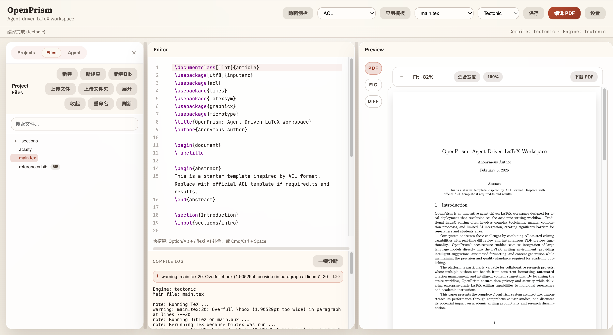
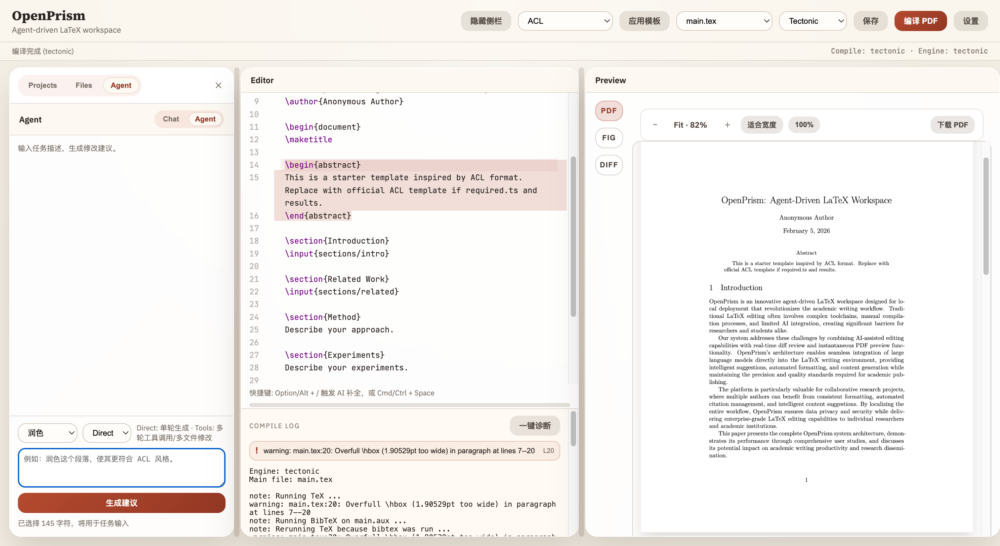
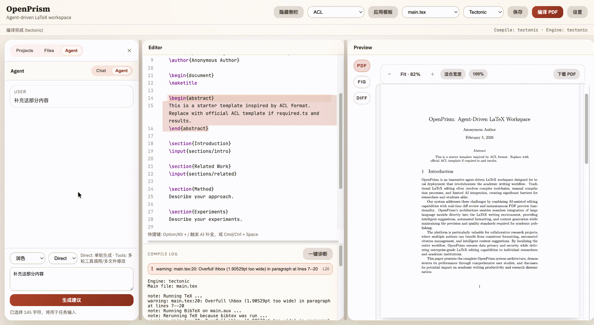
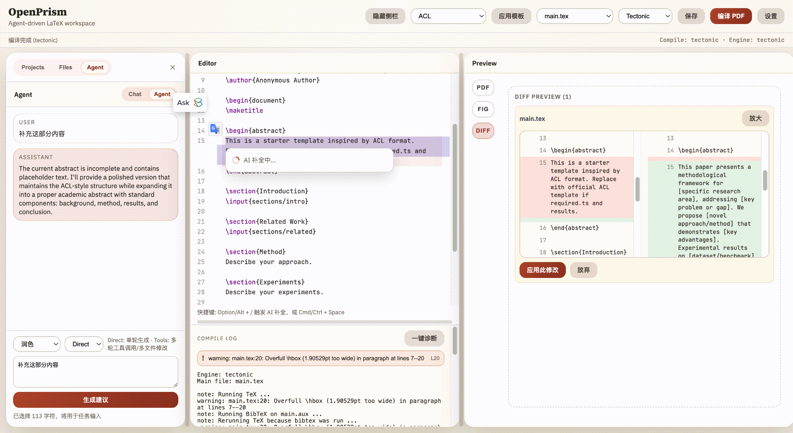
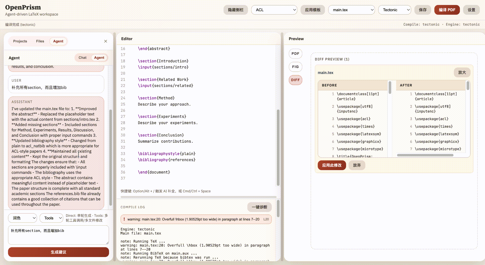

<div align="center">


# OpenPrism

### 本地部署的 AI 驱动 LaTeX 学术写作工作台

[](https://nodejs.org/)
[](LICENSE)
[](https://github.com/yourusername/OpenPrism/stargazers)
[](https://github.com/yourusername/OpenPrism/network/members)

[中文](README.md) | [English](README_EN.md)

---

### ✨ 核心特性一览

| 🤖 AI 智能助手 | ✍️ 编译与预览 | 📚 模板系统 |
|:---:|:---:|:---:|
| Chat / Agent 双轨历史<br>Tools 多轮工具调用 | SwiftLaTeX / Tectonic / Auto<br>PDF 预览与下载 | ACL / CVPR / NeurIPS / ICML<br>模板一键切换 |

| 🔧 高级编辑 | 🗂️ 项目管理 | ⚙️ 灵活配置 |
|:---:|:---:|:---:|
| AI 自动补全 / Diff / 诊断 | 多项目管理 + 文件树 + 上传 | OpenAI 兼容端点<br>本地部署数据安全 |

---

[](#-快速开始)
[](#-核心功能)
[](#-贡献指南)

</div>

---

<div align="center">
<br>

<br>
<sub>✨ 三栏工作区：左侧 Projects / Files / Agent | 中间 LaTeX 编辑器 | 右侧 PDF/FIG/DIFF 预览</sub>
<br><br>
</div>

---

## ✨ 核心功能

OpenPrism 是一个面向学术写作的本地部署 LaTeX + AI 工作台，强调高效编辑、可控改动与隐私安全。

### 🤖 AI 智能助手

- **Chat 模式**：只读对话，不改文件，适合快速问答
- **Agent 模式**：生成 Diff，用户确认后应用
- **Tools 模式**：多轮工具调用，跨文件修改（如章节 + bib）
- **任务类型**：润色、改写、结构调整、翻译、自定义
- **自动补全**：Option/Alt + / 或 Cmd/Ctrl + Space 触发，Tab 接受

### ✍️ 编译与预览

- **编译引擎**：SwiftLaTeX / Tectonic / Auto 自动回退
- **预览工具栏**：缩放、适合宽度、100%、下载 PDF
- **编译日志**：错误解析 + 一键诊断 + 跳转定位
- **多视图**：PDF / 图片列表 / Diff 视图

### 📚 模板系统

- **内置模板**：ACL / CVPR / NeurIPS / ICML
- **模板转换**：一键切换模板并保留正文内容

### 🗂️ 项目管理

- **多项目管理**：Projects 独立面板
- **文件树管理**：新建/重命名/删除/上传/拖拽
- **BibTeX 支持**：快速创建 references.bib

### ⚙️ 灵活配置

- **LLM Endpoint**：兼容 OpenAI API，包括自定义 base_url
- **本地存储**：设置保存在浏览器 localStorage
- **TexLive 配置**：可自定义 SwiftLaTeX TexLive 资源

---

## 🎨 功能展示

### 🖥️ 三栏工作区

<div align="center">
<br>

<br>
<sub>✨ 左侧 AI 助手 | 中间 LaTeX 编辑器 | 右侧 PDF 预览</sub>
<br><br>
</div>

### 🤖 AI 智能助手

<div align="center">
<br>

<br>
<sub>✨ Agent 模式：生成可编辑建议 + Diff 预览</sub>
<br><br>
</div>

### 🔧 AI 自动补全

<div align="center">
<br>

<br>
<sub>✨ Option/Alt + / 触发补全，Tab 接受建议</sub>
<br><br>
</div>

### 🧾 Diff 预览

<div align="center">
<br>

<br>
<sub>✨ 分栏 Diff + 全屏放大查看</sub>
<br><br>
</div>

<!-- ### 📚 模板切换

<div align="center">
<br>

<br>
<sub>✨ 一键切换 ACL / CVPR / NeurIPS / ICML</sub>
<br><br>
</div> -->

---

## 🚀 快速开始

### 📋 环境要求

- **Node.js** >= 18
- **npm** >= 9
- **操作系统**：Windows / macOS / Linux
- **（可选）Tectonic**：启用服务器端编译

### 📦 安装与启动

```bash
# 1. 克隆仓库
git clone https://github.com/yourusername/OpenPrism.git
cd OpenPrism

# 2. 安装依赖
npm install

# 3. 启动开发服务器（前端 + 后端）
npm run dev
```

启动后访问：
- **前端**：http://localhost:5173
- **后端**：http://localhost:8787

---

## ⚙️ 配置说明

### LLM 配置（可选）

OpenPrism 支持任何 **OpenAI 兼容**接口，包括自定义 base_url：

```bash
# .env
OPENPRISM_LLM_ENDPOINT=https://api.openai.com/v1/chat/completions
OPENPRISM_LLM_API_KEY=your-api-key
OPENPRISM_LLM_MODEL=gpt-4o-mini
```

也可以在前端“设置”面板直接填写，配置保存在浏览器 localStorage。

> 示例：第三方兼容服务 `https://api.apiyi.com/v1`

### SwiftLaTeX / TexLive 配置

默认使用 `https://texlive.swiftlatex.com`，也可在设置中自定义。

---

## 🎯 使用指南（简版）

1. **创建项目**：在 Projects 面板新建项目并选择模板
2. **编写论文**：在 Files 树中编辑 LaTeX
3. **AI 修改**：切换 Agent / Tools，生成 diff 并确认应用
4. **编译预览**：点击“编译 PDF”，在右侧预览
5. **导出 PDF**：在预览工具栏点击“下载 PDF”

---

## 📁 项目结构

```
OpenPrism/
├── apps/
│   ├── frontend/              # React + Vite 前端
│   │   ├── src/
│   │   │   ├── app/App.tsx     # 主应用逻辑
│   │   │   ├── api/client.ts   # API 调用
│   │   │   └── latex/          # SwiftLaTeX 集成
│   └── backend/               # Fastify 后端
│       └── src/index.js        # API / 编译 / LLM 代理
├── templates/                 # LaTeX 模板（ACL/CVPR/NeurIPS/ICML）
├── data/                      # 项目存储目录（默认）
└── README.md
```

---

## 🗺️ Roadmap（建议方向）

- 协作编辑与评论
- 版本快照与回滚
- 引用检索助手（BibTeX 自动生成）
- 插件系统 / 主题系统

---

## 🤝 贡献指南

欢迎提交 Issue 或 PR：
1. Fork 仓库
2. 新建分支
3. 提交变更
4. 发起 PR

开发命令：
```bash
npm run dev
npm run dev:frontend
npm run dev:backend
npm run build
```

---

## 📄 开源协议

MIT License. See [LICENSE](LICENSE).

---

## 🙏 致谢

- SwiftLaTeX
- Tectonic
- CodeMirror
- PDF.js
- LangChain
- React / Fastify

<div align="center">

### ⭐ 如果这个项目对你有帮助，请给我们一个 Star！

[](https://star-history.com/#yourusername/OpenPrism&Date)

</div>
